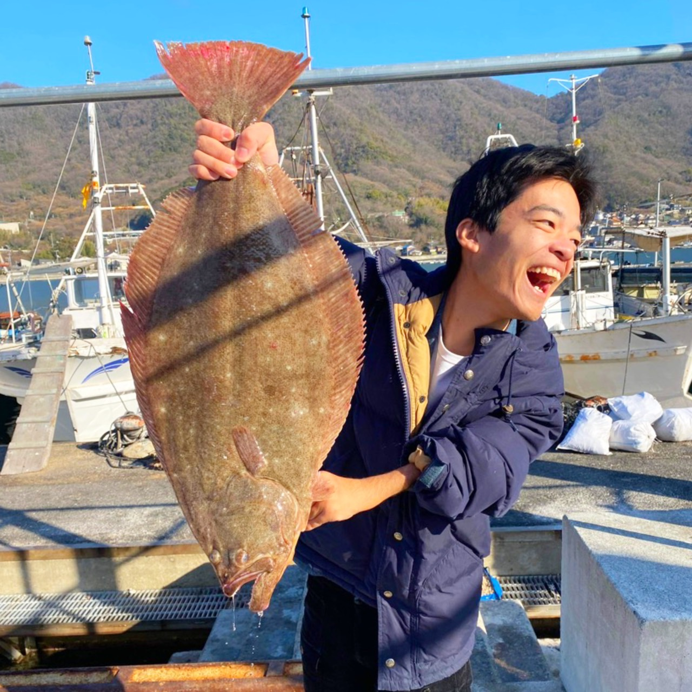

大屋 進之介  
富山のさかなクン
---

#### プロフィール
Oya-Shinnnosuke  
東京海洋大学  博士後期課程2年 （海洋科学技術研究科 応用環境システム学専攻）
水産コミュニケーター  
海業と海洋教育を研究・推進しています

海の身近さを、水産の魅力を多くの人に伝える  
email:  d252003@edu.kaiyodai.ac.jp

---
- [活動の想い](./passion.html)
- [研究の内容・実績](./study.html)
- [イベント・講演会](./event.html)
- [メディア情報](media.html)
- [おさかなイラスト集](./illust.html)
